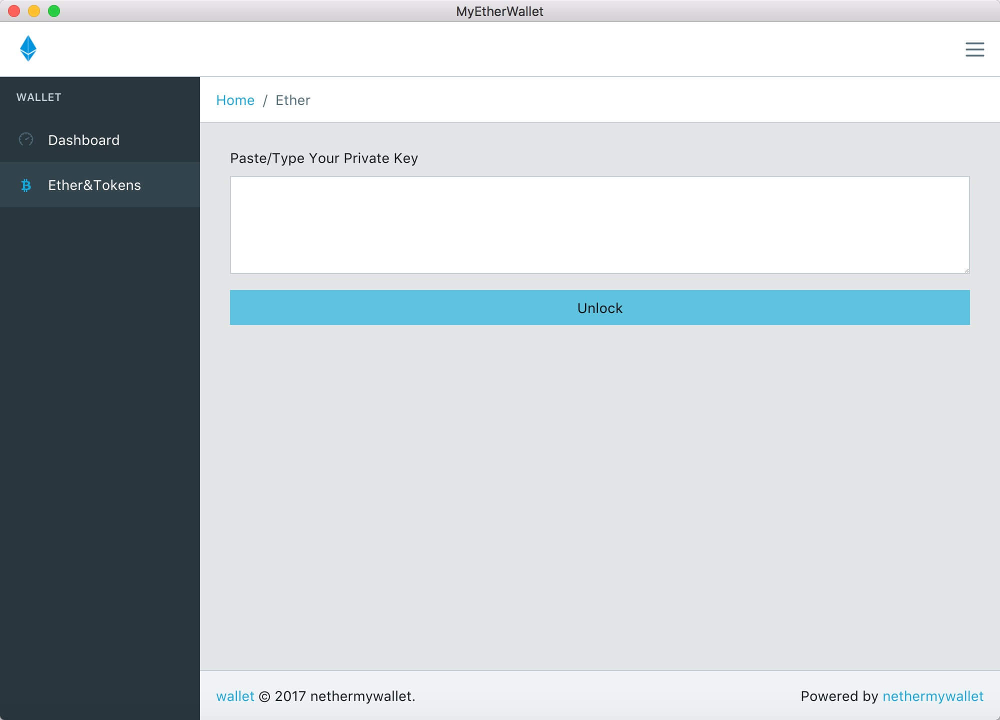
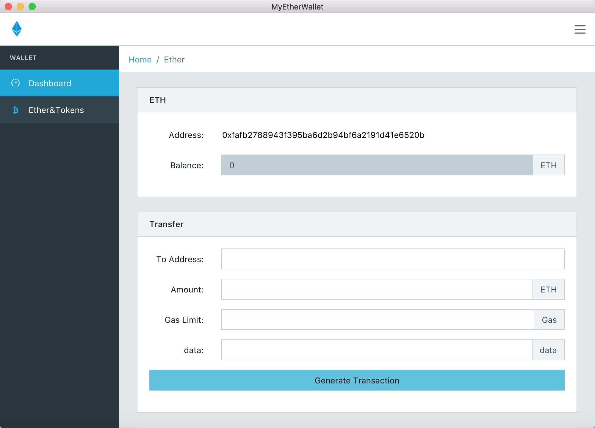

# netherwallet
An electron.js application for  ether wallet


## Getting Started

```shell
npm install
npm start
```

## Previews




## API
- https://github.com/ethereum/wiki/wiki/JSON-RPC

## Nodes
- https://ropsten.infura.io/
- https://www.myetherapi.com/
